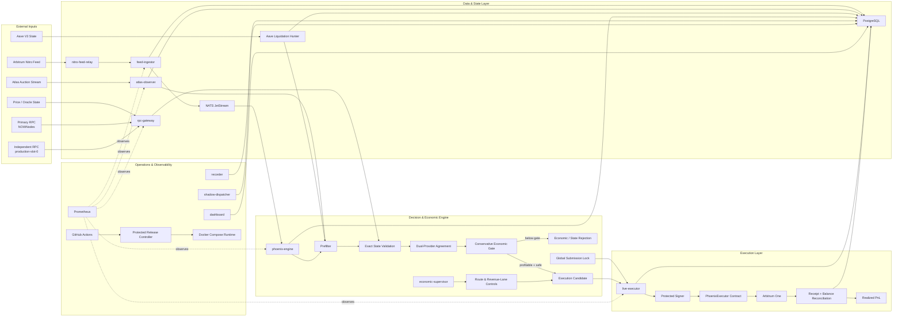
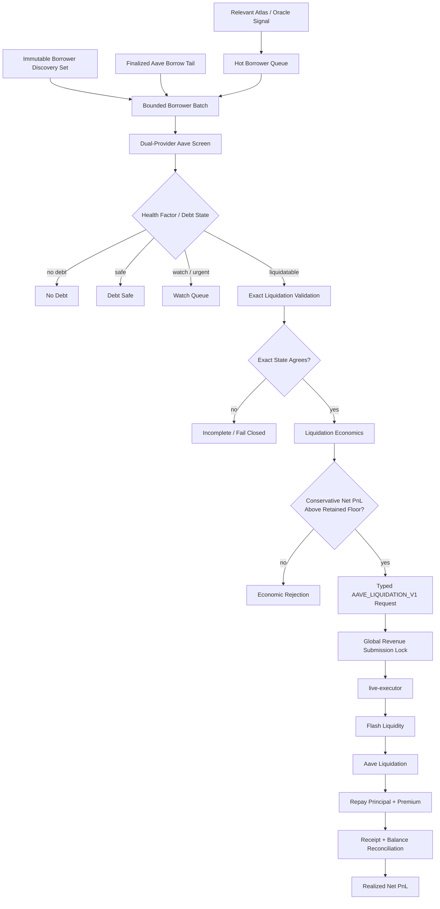
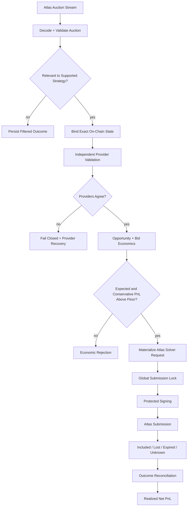
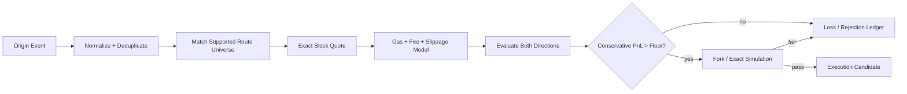
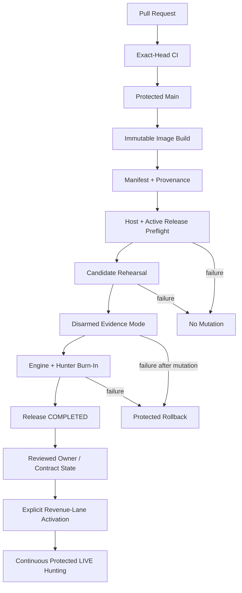

# Phoenix (Anti-Gravity Phoenix v4)

> **A production-grade, AI-assisted financial intelligence and execution system for Arbitrum.**

Phoenix combines real-time blockchain data, independent state verification, conservative transaction economics, protected execution, and production observability in one end-to-end system.

It currently supports three opportunity lanes:

- **Aave V3 liquidation intelligence and execution readiness**
- **Atlas auction monitoring and solver opportunity handling**
- **Origin-aware DEX arbitrage / backrun research across V3-style pools**

Phoenix is designed to answer one question safely:

> **Is this opportunity still profitable after every known cost, execution constraint, and uncertainty reserve?**

No profitability is guaranteed. The system is intentionally fail-closed and will not submit a transaction unless all technical, economic, and operational gates pass.

---

## Why Phoenix Exists

Most blockchain trading systems are described as strategy code.

In practice, a production system must coordinate much more:

- real-time event ingestion
- on-chain account and reserve state
- independent RPC evidence
- opportunity classification
- gas, slippage, flash-loan, auction, and infrastructure costs
- signer and nonce safety
- one-transaction-at-a-time enforcement
- receipts and balance reconciliation
- deployment, rollback, monitoring, and incident recovery

Phoenix treats all of those as one product and one control system.

---

## System Overview



---

## Core Opportunity Algorithm

Phoenix uses a multi-stage decision pipeline. Cheap checks run first; expensive and authority-bearing checks run only when needed.

```text
1. Ingest an event, borrower, auction, or route opportunity.
2. Normalize identity and reject duplicates or malformed evidence.
3. Run low-cost prefilters:
   - chain and protocol relevance
   - freshness
   - debt presence
   - health-factor / opportunity threshold
   - supported asset, pool, router, and route policy
4. Bind the opportunity to an exact finalized block.
5. Query two independent RPC providers.
6. Require exact agreement on:
   - chain identity
   - finalized block number and hash
   - account / reserve state
   - prices and required contract state
7. Estimate the full economic outcome:
   - gross opportunity value
   - DEX and protocol fees
   - gas and L1 data cost
   - flash-loan premium
   - Atlas bid or ordering cost
   - slippage and price impact
   - failure, latency, drift, and model reserves
8. Reject the opportunity unless conservative net PnL is above
   the configured retained-profit floor.
9. Revalidate route, lane, signer, contract, nonce, and global lock state.
10. Materialize one typed execution request.
11. Submit at most one revenue transaction at a time.
12. Reconcile the receipt, events, balances, fees, and nonce.
13. Record realized net PnL only after successful reconciliation.
```

### Conceptual Economic Gate

```text
conservative_net_pnl =
    gross_value
  - protocol_and_dex_fees
  - gas_cost
  - l1_data_cost
  - flash_loan_premium
  - atlas_bid_or_ordering_cost
  - slippage_and_price_impact
  - risk_and_model_reserve
```

A candidate may proceed only when:

```text
conservative_net_pnl > retained_profit_floor
```

and every state, control, signer, contract, and lock invariant is valid.

---

## Aave Liquidation Flow



### Flash Liquidity

Flash liquidity is execution plumbing, not a profitability assumption.

Phoenix can source temporary capital for an approved liquidation and must repay principal plus premium in the same transaction. The execution path is rejected unless the liquidation remains profitable after the flash premium and all other modeled costs.

---

## Atlas Auction Flow



---

## DEX Route Research Flow

The original Phoenix lane evaluates origin-aware two-pool V3-style cycles across supported route families.



This lane remains independently controlled from the Aave and Atlas revenue lanes.

---

## Safety Invariants

Phoenix is built around explicit fail-closed controls:

- **Two independent providers** are required for exact authority.
- **Provider disagreement closes execution authority** until fresh agreement returns.
- **One global submission lock** prevents conflicting revenue transactions.
- **One transaction at a time** is enforced across lanes.
- **Signer material is file-mounted and never stored in CI.**
- **Route and revenue lanes have independent armed and kill-switch state.**
- **Unknown submission state blocks new authority.**
- **On-chain execution includes minimum-profit protection.**
- **No-alpha is not treated as an error and never forces a bad trade.**
- **Release failures roll back through protected, version-matched workflows.**
- **Realized PnL is recorded only after receipt and balance reconciliation.**

---

## Revenue Lanes

| Lane | Purpose | Authority Model |
|---|---|---|
| `aave_liquidation` | Screen and execute economically valid Aave V3 liquidations | Independent provider agreement + economic gate + lane controls |
| `atlas_solver` | Monitor auctions and prepare profitable Atlas solver submissions | Auction validation + state agreement + bid economics + lane controls |
| `phoenix_dex` | Research and evaluate origin-aware V3 arbitrage/backrun routes | Route policy + exact simulation + independent controls |

Each lane has its own:

- armed state
- kill switch
- maximum input
- maximum gas
- maximum fee per gas
- daily loss limit
- retained-profit floor
- control epoch

---

## Services

| Service | Language / Runtime | Responsibility |
|---|---|---|
| `nitro-feed-relay` | Arbitrum Nitro | Internal sequencer-feed relay |
| `feed-ingestor` | Go | Ordered event normalization, NATS publication, health and metrics |
| `nats` | NATS JetStream | Durable internal messaging |
| `rpc-gateway` | Rust | Rate-limited RPC access, provider identity, exact dual-provider evidence |
| `atlas-observer` | Go | Continuous Atlas stream observation and Aave opportunity routing |
| `phoenix-engine` | Rust | Strategy evaluation and opportunity processing |
| `live-executor` | Rust | Protected signing, nonce handling, submission, receipt reconciliation |
| `economic-supervisor` | Rust | Revenue-lane control and safety supervision |
| `economic-monitor` | PostgreSQL shell runtime | Financial and operational evidence snapshots |
| `recorder` | Go | Durable runtime evidence |
| `shadow-dispatcher` | Go | Shadow and diagnostic dispatch |
| `postgres` | PostgreSQL | State, controls, signals, requests, attempts, outcomes, PnL |
| `prometheus` | Prometheus | Metrics and health monitoring |
| `dashboard` | Python / Streamlit | Bounded operator visibility |
| release platform | Python + Shell | Immutable release validation, deployment, rollback, reconciliation |

---

## Technology Stack

- **Solidity** — on-chain executor and minimum-profit guards
- **Go** — feed ingestion, Atlas observation, Aave screening, recording
- **Rust** — strategy, RPC gateway, signing and execution control
- **Python** — release controller, validation, monitoring, reporting
- **PostgreSQL** — durable control and economic truth
- **NATS JetStream** — internal event transport
- **Docker Compose** — production service orchestration
- **Prometheus** — metrics and alerting
- **GitHub Actions** — protected CI/CD and immutable artifact delivery
- **Arbitrum One** — execution network
- **Aave V3** — liquidation market and flash liquidity
- **Atlas** — auction and solver opportunity stream

---

## Production Release Model

Phoenix does not enable execution through a normal merge.



Public repository defaults remain safe. Production secrets and activation authority are server-side and are not part of GitHub Actions.

---

## Observability and Economic Truth

Phoenix records both system health and business outcomes.

### Operational evidence

- release SHA and image digests
- service health, restarts, and OOM state
- provider identity, disagreement, cooldown, and recovery
- Atlas connection and auction counters
- Aave cursor, tail, exact queue, and incomplete counts
- signer metadata without exposing key material
- route, global, and revenue-lane controls
- active attempts, unresolved submissions, and global lock state

### Economic evidence

- prefiltered and rejected signals
- exact-pending opportunities
- candidate and execution request counts
- submitted and reconciled outcomes
- gas, L1, flash, ordering, and infrastructure costs
- expected, conservative, chain, and business PnL
- loss-cause ledger and route ranking
- realized net PnL after reconciliation

---

## Local Development

Local development uses deterministic fixtures and local builds.

```bash
cp .env.example .env
docker compose up --build
```

The fixture feed is intentionally forbidden in Production.

### Basic verification

```bash
make verify
```

Useful focused checks:

```bash
powershell -ExecutionPolicy Bypass -File .\scripts\secret-scan.ps1
powershell -ExecutionPolicy Bypass -File .\scripts\forbidden-file-check.ps1

cd feed-ingestor && go test ./...
cd atlas-observer && go test ./...

cargo test --manifest-path rpc-gateway/Cargo.toml
cargo test --manifest-path live-executor/Cargo.toml

python -m unittest discover -s scripts/tests -p "test_*.py"
```

Some Linux, Docker, Foundry, and shell-based production checks require a compatible host.

---

## Repository Layout

```text
.
├── atlas-observer/          # Atlas stream and Aave liquidation hunter
├── feed-ingestor/           # Ordered feed normalization
├── live-executor/           # Protected execution and reconciliation
├── rpc-gateway/             # Independent provider and exact-state gateway
├── phoenix-engine/          # Strategy and opportunity evaluation
├── recorder/                # Durable event and evidence recording
├── migration-runner/        # Canonical database migration runner
├── contracts/               # Solidity executor, interfaces, and fork tests
├── dashboard/               # Operator and economic evidence views
├── migrations/              # Core PostgreSQL schema
├── scripts/                 # Release, monitoring, validation, and reports
├── docs/                    # Architecture, safety, and runbooks
├── fixtures/                # Deterministic local-only test inputs
├── compose.yml              # Local fixture runtime
├── compose.prod.yml         # Production base runtime
└── compose.live-autonomous.yml
```

---

## Security

Do not commit or expose:

- private keys or signer files
- authenticated RPC URLs or API keys
- production environment files
- VPS addresses or SSH material
- database credentials
- unredacted release or incident artifacts containing sensitive values

Phoenix uses placeholders in `.env.example`; real production configuration is installed separately on the target host.

---

## AI-Assisted Engineering

Phoenix was built as an AI-assisted engineering project.

AI accelerated implementation, testing, debugging, documentation, and release analysis. Product definition, architecture, economic policy, risk boundaries, acceptance criteria, production authorization, and operational decisions remained human-owned.

The project explores how a product-oriented builder can coordinate financial engineering, blockchain infrastructure, distributed systems, and production operations with a much smaller team surface.

---

## Current Status

Phoenix supports protected, continuous production hunting with independently controlled Aave and Atlas revenue lanes.

A healthy production system may legitimately remain in:

```text
FULL_LIVE_NO_ALPHA
```

This means the system is live, exact-state authority is available, and no currently observed opportunity passes every profitability and safety gate.

The stronger business terminal state is:

```text
FIRST_POSITIVE_REALIZED_PNL
```

That state is valid only after a real transaction is submitted, confirmed, balance-reconciled, and produces positive realized net PnL.

---

## Disclaimer

This repository is experimental financial infrastructure.

- It is not financial advice.
- It does not guarantee profitability.
- Blockchain transactions carry smart-contract, market, infrastructure, and operational risk.
- Use only with reviewed controls, bounded capital, and independent security assessment.

---

## License

Add the intended license before encouraging external reuse or contributions.
