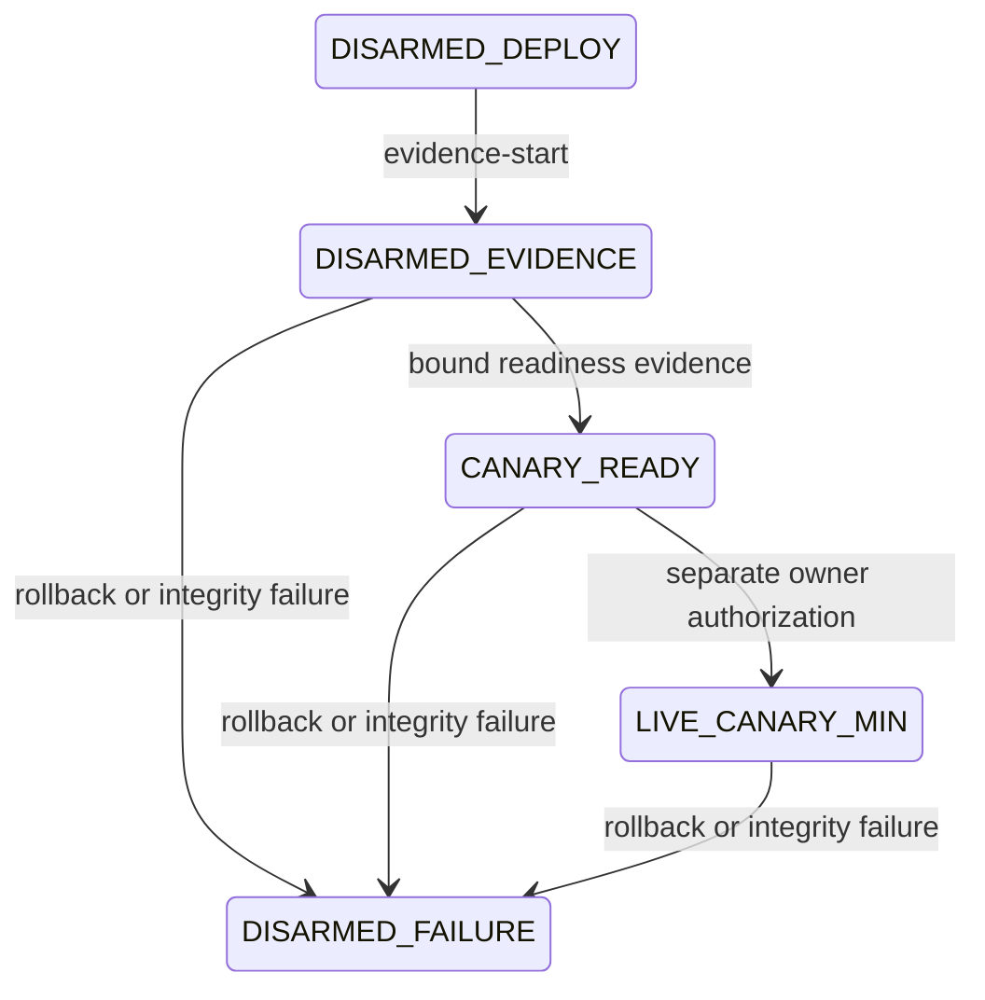

# Phoenix automated economic control

This contract makes realized net PnL after all costs the governing business
metric. Deployment, evidence collection, activation, execution, reconciliation,
promotion, cooldown, and disarm are separate fail-closed phases.

## State machine

The only phases are:

1. `DISARMED_DEPLOY`
2. `DISARMED_EVIDENCE`
3. `CANARY_READY`
4. `LIVE_CANARY_MIN`
5. `LIVE_SCALE_L1`
6. `LIVE_SCALE_L2`
7. `LIVE_SCALE_L3`
8. `LIVE_SCALE_L4`
9. `LIVE_SCALE_L5`
10. `LIVE_MAX_REVIEWED`
11. `COOLDOWN`
12. `DISARMED_FAILURE`

Normal release deployment first persists `DISARMED_DEPLOY`. After the immutable
install, migrations, disarmed Engine/RPC startup, Engine burn-in, post-release
health checks, and fail-closed global and route verification, the signerless
control service invokes `evidence-start`. That command is the only normal path
to durable `DISARMED_EVIDENCE`; it is safely rejected from every other phase.
It never activates the executor, calls owner-unpause, mounts signer material,
or creates a temporary armed interval. Rollback and every terminal integrity
failure enter `DISARMED_FAILURE`; neither path can automatically rearm.



A direct `DISARMED_DEPLOY` to `CANARY_READY` transition is invalid and fails
closed. `evidence-start` locks the economic, global, legacy, and route controls
in one PostgreSQL transaction; verifies release and image identity, route and
policy hashes, zero active attempts, and zero unresolved receipt
reconciliation; then advances the economic epoch and writes the immutable
transition ledger at the same database-clock timestamp. Global and route
authority remain closed throughout.

`CANARY_READY` is created only from complete hash-bound evidence. A separate,
expiring owner authorization may then permit exactly the reviewed route,
policy, release family, executor code, one-transaction concurrency, and ladder.
The first activation is always `LIVE_CANARY_MIN`.

Every state transition is persisted in the immutable
`live_canary.economic_transitions` ledger with the previous and next phase,
previous and next size, reason, release, control epoch, time, and canonical
transition hash.

## Readiness thresholds

The ten-minute readiness record requires all of the following:

- at least 100 supported observations and valid acceptance of at least 99.9%;
- zero process-fatal exits, stale outbox rows, eligible RPC disagreements,
  secondary-verification skips, fork skips, execution requests, and active
  attempts;
- proven quarantine progress and bounded consumer and ACK backlogs;
- two healthy independent RPC providers;
- state age no greater than one block, quote age no greater than 2,000 ms, and
  candidate age no greater than 3,000 ms;
- fork pass rate of at least 95% and prediction error no greater than 10%;
- at least one positive, independently verified, fork-passed candidate;
- wallet gas reserve strictly above its safety floor and current daily loss
  strictly below its limit.

Readiness binds the release SHA, Engine image digest, route universe, route and
risk policies, the durable Evidence-phase economic epoch, global and route
epochs, observation window, candidate evidence, executor code, contract
identity, gas reserve, and daily loss. Its observation window must begin at or
after the database-clock `DISARMED_EVIDENCE` transition and end later than it.
Pre-deployment, stale, expired, or mismatched evidence cannot activate.

## Reviewed capital ladder

| Level | Input (wei WETH) | Input (WETH) |
| --- | ---: | ---: |
| `MIN` | 100000000000000 | 0.0001 |
| `L1` | 250000000000000 | 0.00025 |
| `L2` | 500000000000000 | 0.0005 |
| `L3` | 1000000000000000 | 0.001 |
| `L4` | 2500000000000000 | 0.0025 |
| `L5` | 5000000000000000 | 0.005 |
| `MAX_REVIEWED` | 10000000000000000 | 0.01 |

The active global maximum, route maximum, economic-control level, and candidate
size must all equal the current ladder amount. No path can exceed 0.01 WETH.
Flash liquidity does not make wallet balance a promotion signal; the gas/risk
reserve is tracked separately.

## Execution and promotion

Every eligible candidate must have independent RPC agreement and a
cryptographically bound, successful fork result for the exact event, route,
input, calldata, executor code, pinned block, state, and deadline. Stale,
reverted, mismatched, economically insufficient, or excessive-error fork
evidence rejects the candidate.

A promotion requires at least 20 fully reconciled outcomes at the current
level, aggregate realized net PnL greater than zero, execution success and fork
pass rates of at least 95%, prediction error no greater than 10%, and zero RPC
disagreements, unknown or duplicate submissions, nonce gaps, control
violations, unreconciled receipts, fatal integrity events, or identity
mismatches. Daily loss and three-loss limits must remain unbreached, gas reserve
must remain above its floor, and quote/candidate age limits must hold.

One realized negative outcome immediately freezes promotion, steps down one
level where possible, and enters a 15-minute route cooldown. Economic-quality
degradation does the same. Fork pass rate below 95%, prediction error above
10%, repeated RPC disagreement, three consecutive losses, or the route daily
loss limit disarms the route. Daily loss, unknown or duplicate submission,
nonce inconsistency, overdue reconciliation, fatal integrity, or signer/code/
owner/flash-provider/contract mismatch disarms globally.

Submission is not success. The authoritative outcome binds the transaction
receipt, contract outcome, token balance delta, actual gas and L1 cost, flash
fee, gross PnL, net PnL, predicted and fork-simulated PnL, prediction error,
latencies, and failure reason. Dashboard totals derive from reconciled outcomes.

## Authorized operating boundary

After merge and successful exact-main CI, an authorized disarmed release uses
the immutable controller:

```sh
gh workflow run phoenix-release-controller.yml --ref main \
  -f release_sha="$RELEASE_SHA" \
  -f source_ci_run_id="$SOURCE_CI_RUN_ID" \
  -f source_ci_run_attempt="$SOURCE_CI_RUN_ATTEMPT"
```

That workflow may build and deploy the reviewed release, but the deployment
contract keeps execution disarmed and does not access the signer.

Only after production evidence creates a valid readiness contract and the owner
creates a matching bounded authorization may the separate activation be run on
the production host:

```sh
sudo -n /opt/phoenix/deploy/activate-economic-canary.sh \
  "$RELEASE_SHA" \
  /root/phoenix-authorization/canary-readiness.json \
  /root/phoenix-authorization/automation-authorization.json
```

Both contract files must be regular, non-symlinked, root-owned mode `0600`
files. Activation revalidates the exact active release, consumes the two
contracts, activates exactly `MIN`, performs owner-unpause, and starts the
executor. Failure compensation stops the executor, restores owner-pause when
needed, and disarms autonomous control.

No route expansion or input above `MAX_REVIEWED` is authorized by this
contract. Either change requires a new policy, protected review and CI,
positive reconciled evidence at the existing boundary, and explicit owner
approval.

## Autonomous minimum-canary bridge

While the durable phase is `DISARMED_EVIDENCE`, the unprivileged economic
supervisor continuously revalidates the existing readiness gates. It emits one
short-lived, canonical, hash-bound request only for a fresh supported
Production candidate with independent RPC agreement and an exact profitable
fork pass. The dedicated outbox is the supervisor's only host-facing
capability; it has no Docker socket, signer, `/root`, or host command access.

The root-owned `phoenix-economic-activation.path` unit consumes that fixed
outbox through the immutable Release Platform. Its bounded runner rejects
unsafe metadata, stale or replayed requests, revalidates authoritative state
through `autonomous-control`, atomically materializes fresh readiness and
authorization contracts, and invokes only `activate-economic-canary.sh`.
Activation remains `MIN` and the reviewed script retains its fail-closed
compensation. With no eligible opportunity the path remains idle and discovery
continues normally.
